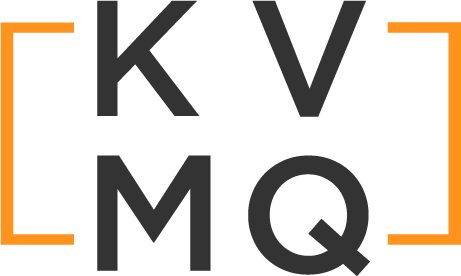

Docs -- [https://pkg.go.dev/github.com/peterfraedrich/kvmq](https://pkg.go.dev/github.com/peterfraedrich/kvmq)


[](https://goreportcard.com/report/github.com/peterfraedrich/kvmq)
[](https://coveralls.io/github/peterfraedrich/kvmq?branch=master)

KVMQ allows you to use key/value stores (or really anything) as messaging queues. The main benefit of this is avoiding adding complexity to your infrastructure by needing to spin up additional services like RabbitMQ or Kafka; instead, you can reuse services you're already using elsewhere, like Redis, an RDBMS, etc.

## Features
* Reuse existing infrastructure
* Durable, fault-tolerant message queue (depending on what backend you use)
* Simple, easy-to-use API
* Based on well-established devops/infrastructure tools
* Extensible: bring your own custom backend!

## TL;DR

```go
package main

import (
	"fmt"

	"github.com/peterfraedrich/kvmq"
)

func main() {

	mq, err := kvmq.NewMQ(&kvmq.Config{Backend: "memory"})
	if err != nil {
		panic(err)
	}

	i := 0
	for i <= 100 {
		// Put and item on the queue
		qo, err := mq.Push([]byte("Hello, is it me you're looking for?"))
		if err != nil {
			fmt.Println(err)
		}
		fmt.Println(qo.ID)
		i++
	}
	fmt.Println("++++++++++++++++++++++++++++++++++++++++++++++++++++++")
	x := 0
	for x <= 100 {
		// Pop an item off the queue
		_, qo, err := mq.Pop()
		if err != nil {
			fmt.Println(err)
		}
		fmt.Println(qo.ID)
		x++
	}
}
```

## Backends
A `backend` is a service that provides the state storage for the message queue. Right now, this package offers four backends:
* In-memory
* Filesystem
* Redis
* Hashicorp Consul
* Kubernetes ConfigMap (coming soon!)

In addition to these built-in backends, there is a fifth type `custom` that allows you to extend KVMQ and bring your own backend. Simply provide a struct that fulfills the `Backend` interface and you're off to the races.

Because the backend logic is separated from the application logic, you are free to use different backends or migrate between them as needed without having to update your application logic. You could start with a smaller-scale backend, like a shared filesysem, and move to something more distributed like a Redis backend as your scale grows. Alternatively, you can use the `memory` backend for local development and testing and the `consul` backend for staging and production.

<b>Currently, the following backends are available:</b>
* In-memory (default)
* Filesystem
* Redis
* RDBMS
	* sqlite
	* MySQL
	* PostgreSQL
	* SQL Server
	* TiDB, CockroachDB, and any other RDBMS compatible with the above API's
* Custom

## Pro/Con

### Pros
* Using a tool that's already in production eliminates the need for spinning up yet-another-tool
* Uses well-known tools/services, no weird, bespoke tools here
* Change backends without changing app logic
* Its always fun to abuse software in ways it wasn't intended to be abused

### Cons
* These backends weren't really designed to do this, so YMMV
* The use of locks in the standard Backends means only one queue worker can write to the queue at a time, but you're free to make an unsafe backend if you wish
* Will not be as performant as a dedicated message broker or stream platform (AMQP, Kafka, etc.)

## Roadmap
- [ ] Unit test coverage -- goal 80%+
- [ ] Logging & Monitoring -- log sink
- [ ] Observability -- emit metrics
- [ ] Update docs
- [ ] Rename `master` to `main`
- [ ] Merge PR into `main`

### License: MIT
